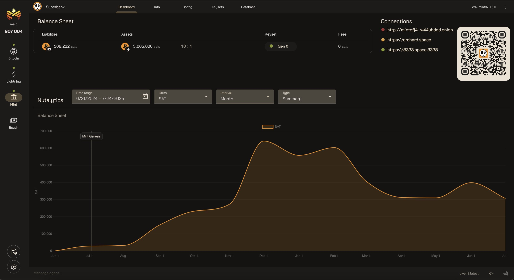

<h1 align="center">Orchard</h1>

<p align="center">
  <br>
  
  <br>
  <br>
  <em>Your sovereign bank in cyberspace</em>
  <p align="center">
    
  </p>
  <br>
</p>

<hr>

# Implementation support

| Protocol       | Implementation                     | Version                    |
| -------------- | ---------------------------------- | -------------------------- |
| Bitcoin        | core (knots compatible)            | (^Satoshi:28.0.0)          |
| Lightning      | lnd, cln                           | (^v0.19.0-beta), (^v25.02) |
| Cashu Mint     | cdk, nutshell                      | (^v0.14.1), (^0.18.2)      |
| Taproot Assets | tapd                               | (^v0.6.1-alpha)            |
| AI             | ollama                             | (^0.13.1)                 |

<br>
<br>

# Setup

## Prerequisites

- Install [Node.js] which includes [Node Package Manager][npm]
  - Recommended version (v22)

## Environment Variables
```bash
cp .env.example .env
# edit .env file
nano .env
```

## Configuration Options
|           | Orchard | Bitcoin | Lightning  | Taproot Assets | Cashu Mint | AI |
| --------- | ------- | ------- | ---------- | -------------- | ---------- | -- |
| Required  | ✅      |         |            |                |            |     |
| Optional  |         | ✅      | ✅          | ✅             | ✅         | ✅  |

<br>
<br>

# Production Setup

## Run the application (standard)
```bash
npm install
npm run build
npm run start
```

## Updating
```bash
git pull
npm install
npm run build
npm run start
```

## Run the application (docker)

**Note:** The nutshell mint rpc can be run in insecure mode, omitting the need for certs.<br>
To allow this in a docker container set `MINT_RPC_MTLS=false` in .env

### Docker images from source

#### Sqlite Cashu Mint
```bash
# Additional env vars
MINT_DATANAME=mint.sqlite3
MINT_DATADIR=/path/to/data/directory
```
```bash
docker compose build orchard
docker compose -f docker-compose.yml -f docker-compose.sqlite.yml up -d
```

#### Postgres Cashu Mint
```bash
docker compose build orchard
docker compose up -d
```

### Docker images from registery

**Note:** When using registry images, you can specify a version using the `VERSION` environment variable. If not specified, it defaults to `latest` which may not be compatible with older versions of the codebase.

#### Sqlite Cashu Mint
```bash
# Additional env vars
MINT_DATANAME=mint.sqlite3
MINT_DATADIR=/path/to/data/directory
```
```bash
VERSION=latest FLAVOR=sqlite \
docker compose -f docker-compose.yml -f docker-compose.sqlite.yml -f compose.image.yml up -d
```

#### Postgres Cashu Mint
```bash
VERSION=latest FLAVOR=postgres \
docker compose -f docker-compose.yml -f compose.image.yml up -d
```

<br>
<br>

# Development Setup

## Run the application

### Package Management 
```bash
npm install
```

### Client
```bash
npm run start:client
```

### Server
```bash
npm run start:server
```

### Tests
```bash
npm run format
npm run lint
npm run test
```